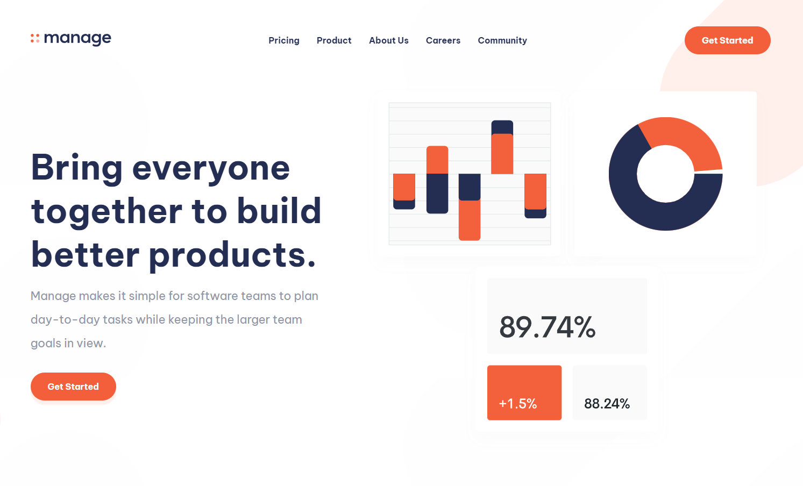

# Frontend Mentor - Manage landing page solution

This is a solution to the [Manage landing page challenge on Frontend Mentor](https://www.frontendmentor.io/challenges/manage-landing-page-SLXqC6P5). Frontend Mentor challenges help you improve your coding skills by building realistic projects. 

## Table of contents

- [Overview](#overview)
  - [The challenge](#the-challenge)
  - [Screenshot](#screenshot)
  - [Links](#links)
- [My process](#my-process)
  - [Built with](#built-with)
  - [What I learned](#what-i-learned)
  - [Continued development](#continued-development)
  - [Useful resources](#useful-resources)
- [Author](#author)

## Overview

### The challenge

Users should be able to:

- View the optimal layout for the site depending on their device's screen size
- See hover states for all interactive elements on the page
- See all testimonials in a horizontal slider
- Receive an error message when the newsletter sign up `form` is submitted if:
  - The `input` field is empty
  - The email address is not formatted correctly

### Screenshot

### Links

- Solution Code: [Repo](https://github.com/Arteque/Manage-landing-page)
- Live Site URL: [Live page](https://arteque.github.io/Manage-landing-page/)

### Built with

- HTML5
- CSS/Scss
- Flexbox
- CSS Grid
- Mobile-first workflow
- Javascript
- JSON

## Author

- Website - [Ahmed Lemssiah](https://www.artecke.de)
- Frontend Mentor - [@Arteque](https://www.frontendmentor.io/profile/Arteque)
- Twitter - [@ArteckeDesign](https://twitter.com/ArteckeDesign)
- Youtube - [@artecke99999](https://www.youtube.com/channel/UCjzbCFOWdsdV6gxa5ho7EtQ)
- Instagram - [@artt3k](https://www.instagram.com/artt3k/)

